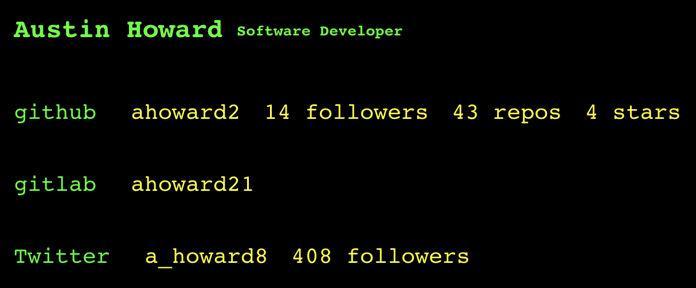

# My Personal Dashboard

> Dashboard application displaying information about myself. Aggregate data on the Node server from vendor API's and fit the REST API to the frontend client. The Node server also serves the client.

### The Server

- Backend for frontend server built with [Nest.js](https://nestjs.com/).
- A functional approach to Nest with simple route handler functions instead of Nest's traditional providers model (inspired by my [easier-nest-server](https://github.com/ahoward2/easier-nest-server) project).
- Custom in-memory caching per route (no package dependencies).

### The Client

- User interface built with [React](https://reactjs.org/). No fancy state management yet but probably will use Redux Toolkit Query to learn something new -> React Query is great but I already know it decently well.
- Terminal inspired design.
