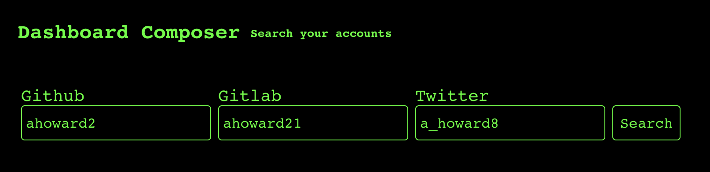

# My Personal Dashboard

> Composable dashboard application displaying information about a variety of user accounts. Aggregate data on the Node server from vendor API's and fit the REST API to the frontend client. The Node server also serves the client.

### The Server

- Backend for frontend server built with [Nest.js](https://nestjs.com/).
- A functional approach to Nest with simple route handler functions instead of Nest's traditional providers model (inspired by my [easier-nest-server](https://github.com/ahoward2/easier-nest-server) project).
- Custom in-memory caching (no package dependencies).
- External data retrieved:
  - General github profile information.
  - Github repositories stats.
  - General gitlab profile information.
  - General twitter information.
  - Last 90 tweets twitter stats.

### The Client

- User interface built with [React](https://reactjs.org/).
- Client routing with [React Location](https://react-location.tanstack.com/).
- Client queries and caching with [React Query](https://react-query.tanstack.com/).
- Terminal inspired design.
