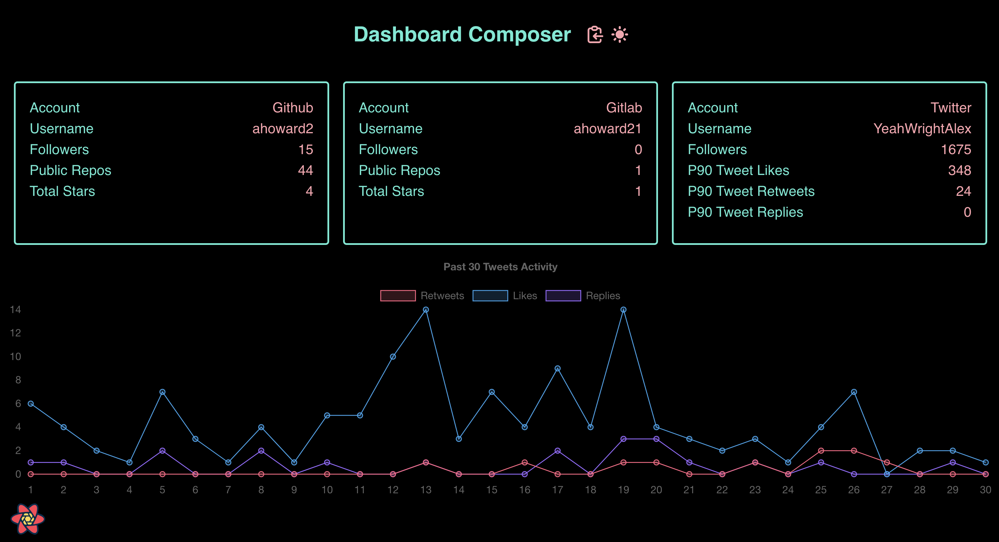
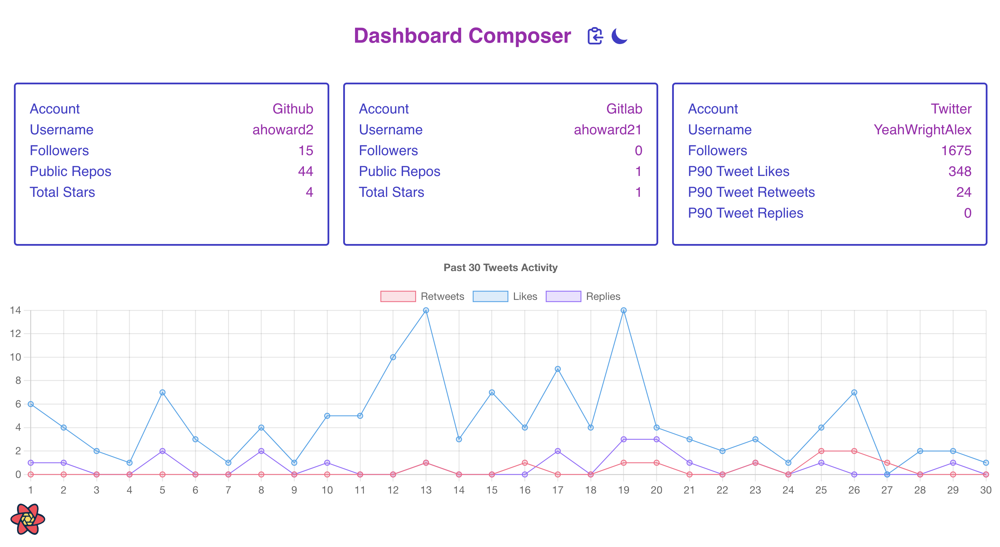

# Composable Personal Dashboard

> Composable dashboard application displaying information about a variety of user accounts. Aggregate data on the Node server from vendor API's and fit the REST API to the frontend client. The Node server also serves the client.

### The Server

- Backend for frontend server built with [Nest.js](https://nestjs.com/).
- A functional approach to Nest with simple route handler functions instead of Nest's traditional providers model (inspired by my [easier-nest-server](https://github.com/ahoward2/easier-nest-server) project).
- Custom in-memory caching (no package dependencies).
- External data retrieved:
  - General github profile information.
  - Github repositories stats.
  - General gitlab profile information.
  - General twitter information.
  - Last 90 tweets twitter stats.
  - Last 30 tweets timeline data.

### The Client

- User interface built with [React](https://reactjs.org/).
  - Custom Webpack configuration with [esbuild-loader](https://github.com/privatenumber/esbuild-loader) for ⚡️.
    - Suspense boundary on pages for tiny main bundle (could load pages from remote locations - module federation 😉).
- Client routing with [React Location](https://react-location.tanstack.com/).
  - All data requirements handled at the route level to decouple initiating data fetching from component rendering.
- Client queries and caching with [React Query](https://react-query.tanstack.com/).
  - Caching handled at the route level.
- Terminal inspired design.
  - Styled with [tailwindcss](https://tailwindcss.com/) because it's awesome and super easy to be fast with.
  - Light & dark modes.
- Data visualization & charting with [chartjs](https://www.chartjs.org/docs/latest/).

### Deployment

- Deployed as an edge container with [fly.io](https://fly.io/).
  - 1 region (Miami Florida, US).

### Considerations

- Caching on the server in-memory could eventually result in needing to increase the memory capacity of the server. Redis or a CDN could probably do a better job of this so I'm looking at what is the most inexpensive option. In the mean time a possible solution would be to clean up any long running cached objects that aren't really being used for a while.
- Rate limits on external API's may get hit which could result in all users not being able to request new data if it's not already cached on the server. This will take some trial and error to see what the right combination of client/server caching and rate limiting on the server to avoid hitting limits.
- I originally wanted to use Nest JS to learn how to use it but I think it's a little overkill for this. The size of the docker image could probably be smaller and the server could be faster using something like [fastify](https://www.fastify.io/).

### Screenshots

